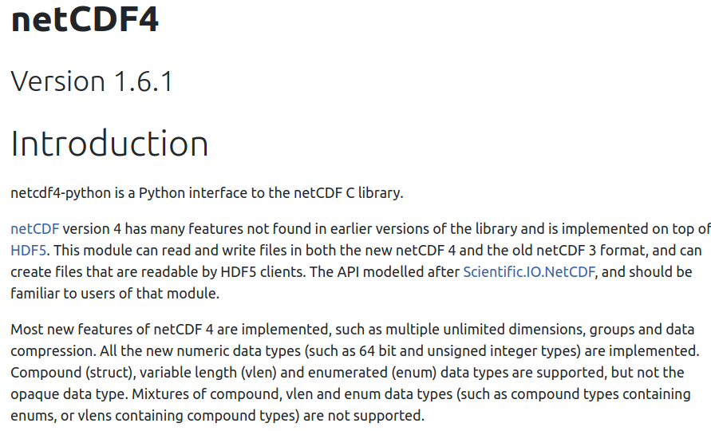
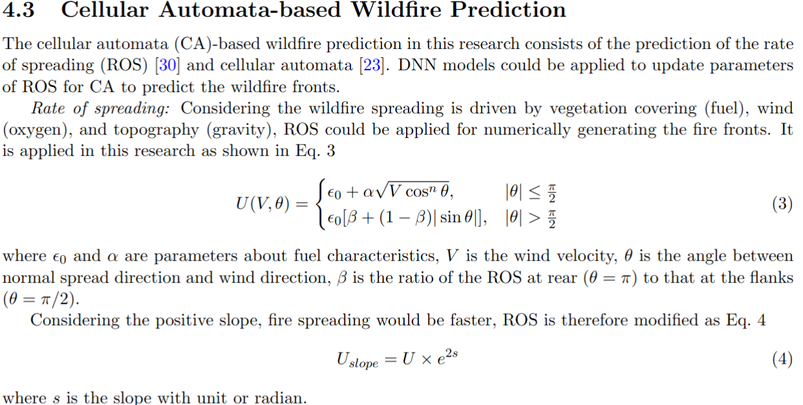
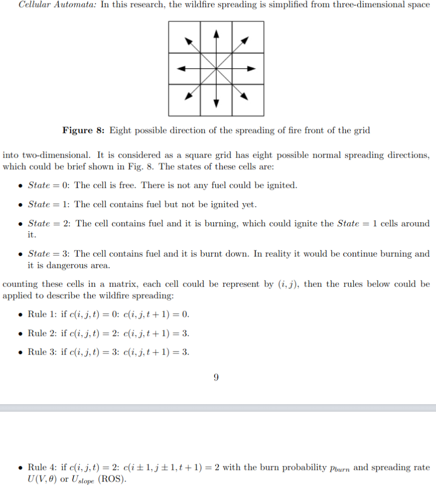
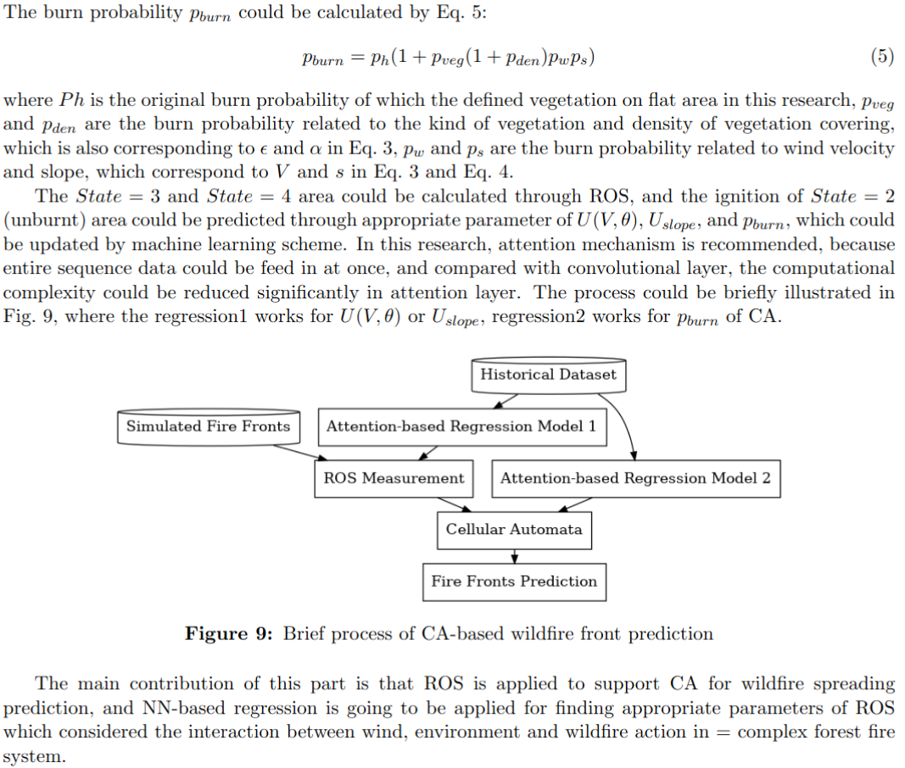
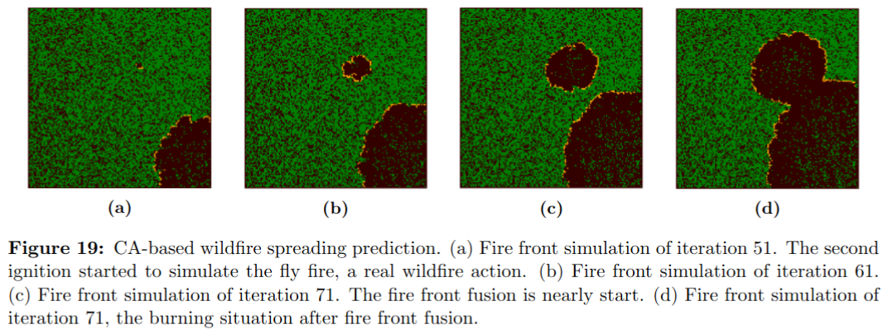

# For wildfire Spreading Prediction 2022-12-13
Considering the work about a 'data analysis and deep learning'-based wildfire spreading prediction scheme, there are
some thing I was considering :thinking: :
* The information needed for analysis;
* The prediction models;
* What to do after the prediction.

## The information needed for analysis 
Based on tons of work of other researchers and our previous study, it could be considered that the wildfire behavior
is related to three main elements: 
* Oxygen, or it could be considered as the wind, because wind will bring oxygen;
* Vegetation, or it could be considered as the meterial to burn, it is apparent that some kind of vegetations are filled
  of oil and easy to be ignited;
* Geographical information, it is considered as an important element just because of a phenominon, 'fire is climbing'.

Except for the top **3** elements, the wildfire behavior is accually much more complex.   
For example, the behavior of wildfire will be impacted by:  
The interaction between these elements:  
* Actually, the wind should not be simply considered as one element, because the wind may lead the direction of fire;
* However, the direction of fire is lead by not only wind, but also the topography and geography. Some consideration
  could be seen in the following draws (Apologize, I am not that good at draw):

The interaction between local environment and wildfire itself:
* The main interation is between wind and fire, it could be cinsidered as shown in the flow bellow:  
* The most obvious one is that the wildfire changes the vegetation coverage;
* Sometimes, the wildfire will change the geographical characteristics, such as the water path, this is long story,
  which is not going to be considered in our study.

Therefore, it might be nessesary to acquire appropriate information or dataset to analyze.
It is found that the weather dataset or climate dataset are commonly stored in a network common data form (NetCDF)
format, which is ended by `.nc`(as NetCDF3) or `.nc4`(as NetCDF4).  

Luckly, there is an API for us to deal with the `.nc` format data. As shown below is the introduction doc of netCDF4 
(https://unidata.github.io/netcdf4-python/):

 

  

Install netCDF4: `conda install -conda-forge netCDF4`

I also find there are two place to acquire the data:  
* NASA OPeNDAP (https://opendap.larc.nasa.gov/opendap/) by filling a data access form, there are detailed tutarials
  could be seen on YOUTUBE: https://youtu.be/npOKkLtXE0w 
* Data access viewer by NASA POWER (https://power.larc.nasa.gov/data-access-viewer/). tutorial: https://youtu.be/X56vtqutv9o 

Based on these tools and dataset, it migt be helpful to analyze the local environment so that we could predict the
wildfire spreading better.  

## The Wildfire Spreading Models  
FARSITE-based model and Celluar Automata (CA)-based model.  
### FARSITE-based model  
In my opinion, FARSITE is a oval-based model to predict the wildfire spreading through cmputing some exact parameters.
During my first reading about its performance, it is stated with the prediction accuracy of 30%, which might be not
enough, and the most important problem is that it is found in other paper that it is hard
to design a real-world experiment to study its performance.  
So I just abandoned this scheme.  
### CA-based model 
Another model is CA-based model, more related information could be find, and there is a demo to see its performance. And
we simply designed an experiment to ignit a paper, the fire performance is very similar as the simulation result.
Although we are still considering the DNN enhanced e parameters for its quatitively analysis, it is thought CA is more
fancy and easier to show and state clearly. 
The related work we did for CA could be seen as follows:

More information of CA predicting wildfire spreading with more complex scenarios could be found at: 
https://github.com/XC-Li/Parallel_CellularAutomaton_Wildfire

### Re-thinking FARSITE  
Based on last meeting, thanks for the presentation of Hamza, it seems more acceptable to apply FARSITE in real wildfire
management tasks.  
It is now being repleased as a offical software based on FARSITE and FlamMap, so I guess it could be more convient to
use straightly.  
Also, some papers published **in recent years** are find, which might be cite-able.

## After the prediction
To plan the path for pointer and tanker more appropriate, the working scinario is assumed as follows:
