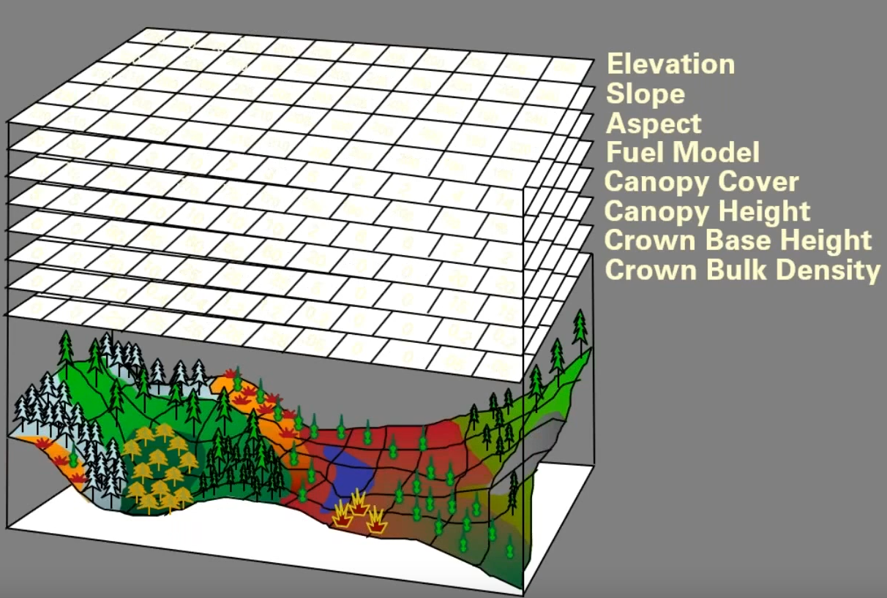
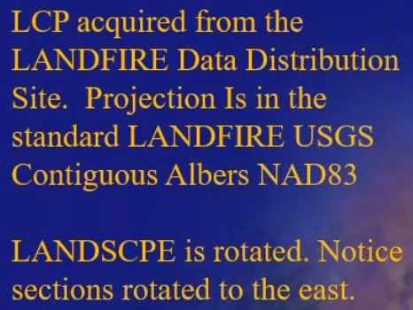
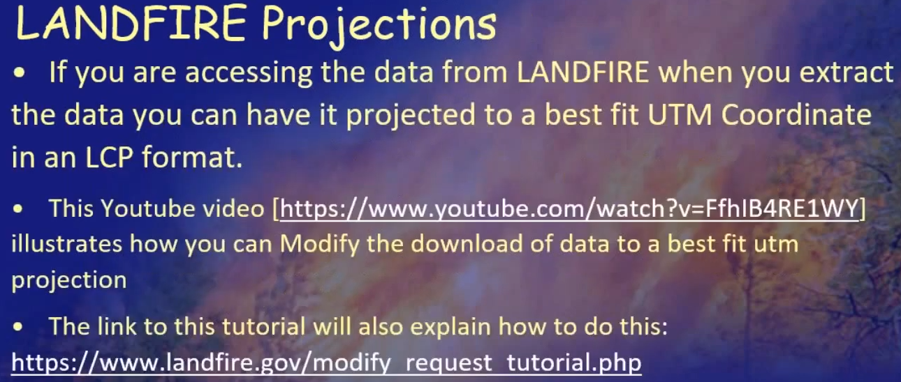
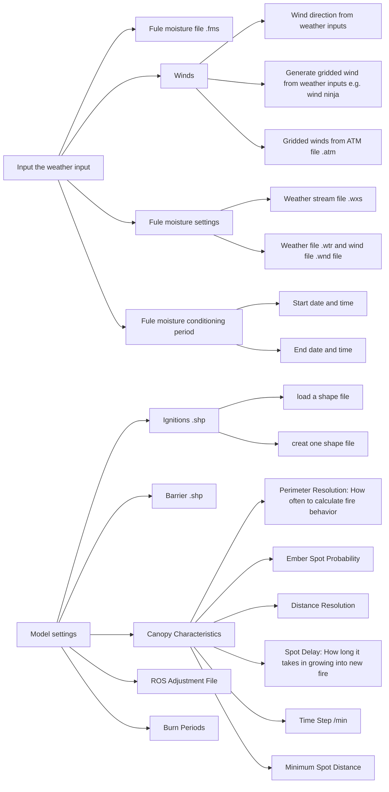
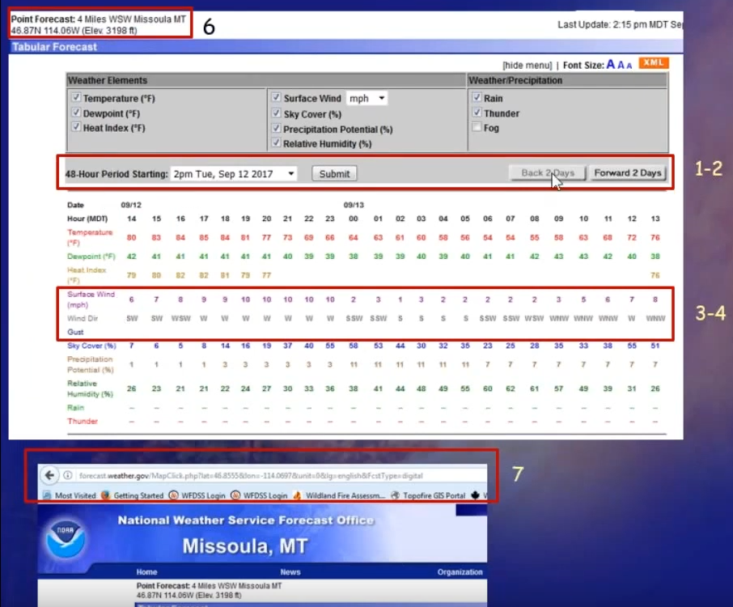
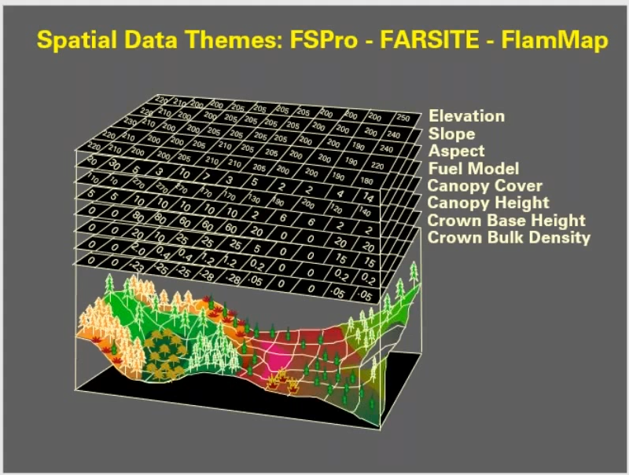

# [Overview of FlamMap6 Geospatial Modeling Capabilities](https://www.youtube.com/watch?v=DClutrnqzys)
Presented by: Chuck McHugh
## Outlines
* FARSITE & FlamMap History
* What's New
* Where to get it 
* Landscape Data Sources 
* Demo 

## Abbrivations
FARSITE -- fire area simulator  
FOFEM -- First order fire effects model  
FSPro: A geospatial probabilistic model that predicts fire growth  
IFTDSS -- Interagenny fule treatment decisions support system  
LCP -- Landscape (.LSCP file)  
LF -- Landfire  
MTT -- Minimum travel time  
NTFB -- Near-term fire behavior  
STFB -- Short-term fire behavior  
TOM -- treatment optimzation model  
UTM -- Universal transverse mercator   
WFDSS -- Wildland fire decision support system  

## FARSITE & FlamMap History 
* FARSITE History  

| Time      | Developments                                                                                   |
| ---       | ---                                                                                            |
| 1991-1992 | Tinkering                                                                                      |
| 1994-1995 | NPS funded development of v1.0; Distributed 2/1995                                             |
| 1995-1996 | NPS/USFS funded development of v2.0; Distributed 2/1996                                        |
| 1996      | NPS/USFS/CDF funded development of v3.0                                                        |
| 2002      | v4.0                                                                                           |
| 2008      | v4.1 (The last one formal version)                                                             |
| 1998-2007 | Taught in S493                                                                                 |
| 2009-2013 | Taught in S495                                                                                 |
| 2010      | Incorporated into Wildland fire decison support system (WFDSS) as Near to fire behavior (NTFB) |
| 2017      | Incorporated into FlamMap6                                                                     |

* FlamMap History  

| Time      | Developments                                                              |
| ---       | ---                                                                       |
| 1998      | Initial development of FlamMap                                            |
| 2000-2002 | development of Minimum travel time (MTT)                                  |
| 2004      | FlamMap2, Basic fire behavior                                             |
| 2006      | FlamMap3, MTT to look the fire spread, treatment optimization model (TOM) |
| 2007      | FlamMap4, Fire spread probability (FSPro)                                 |
| 2010      | Incorporated into WFDSS as Short-term Fire Behavior (STFB)                |
| 2012      | FlamMap5, WindNinja, Spotting, Landscape Burn Probability                 |
| 2018      | FlamMap6, Farsite, Projection, LCP editor, run logs: WFDSS, IFTDSS        |
| 2020      | FlamMap6.1, Wx Editing, GeoTiffs                                          |
| 2022      | FlamMap6.2, Get Landscape utility, Spatial FOFEM                          |
| 2009-2013 | Taught in S495                                                            |

* Wildland Fire Decisions Support System (WFDSS)

| Time | Developments                                          |
| ---  | ---                                                   |
| 2007 | FSPro (FlamMap4, MTT)                                 |
| 2010 | BASIC(FlamMap5), STFB, Near-term fire behavior (NTFB) |

* Interagenny Fule Treatment Decisions Support System (IFTDSS)

| Time                                                          | Developments                                                                |
| ---                                                           | ---                                                                         |
| 2018-FlamMap6                                                 | BASIC, WindNinja                                                            |
| 2019                                                          | Landscape Burn Probability Modeling, FlamMap, MTT, STFB                     |
| Future-FlamMap(in 2020, and 2022 webinar, some features came) | Short-term fire Behavior (STFB), Landscape Burn Probability Modeling (LBPM) |

## What's New in FlamMap6  
* FARSITE (NTFB, WFDSS)
  * Gridded winds in FARSITE 
  * Internal or External (WindNinja)  
* LCP Editor
  * Global Changes  
  * Vector-Raster masks to control  
<!-- What is 'Run Log'-->
* Import Run Logs from WFDSS  
  * BASIC, STFB, NTFB  
  * Spatial Data from WFDSS & IFTDSS  

## What's New in FlamMap6.2 
* **Previous Release -- 2021.04 FlamMap6.1** 
* Additional support for raster formats
  * Additional GeoTiff support for importing/exporting raster files. Export of raster files now include a .AUX .XML file
    caontaining theme metadata  
* FeoTiff noew supported when generating landscapes
  * Single band GeoTIFF (.TIF) files can now be used generating a new landscape  
  * The resulting landscape can be saved in GeoTIFF file format
* Save Raster Outputs as Single GeoTIFF file 
  * All Raster outputs can now all be savefd in ASCII or GeoTIFF formats 
  * All Raster outputs can now all be saved in one multi-band GeoTIFF file with the Raster Outputs to GeoTIFF shortcut
    command.
* Measure Tool: Users can draw lines and polygons on a landscape and calculate lengths and area  
New tools to edit and graph weather
* **Current Release -- 2022.06 FlamMap6.2**
* Get landscape utility for the creation and extraction of LANDFIRE based landscape file
* Spatial version of the first order fire effects model (FOFEM, v6.7)

## Where to Get it  
* Main FlamMap Page Link: https://www.firelab.org/project/flammap  
* FlamMap Software Download Link: https://www.firelab.org/documents/flammap-software

## Scan on the Release notes of FlamMap version 6.0.0
1. addresses bugs in FlamMap5.0
2. **FlamMap 6.0 is only useable in a Windows64-bit Operating System**
3. Reprojection of Auxiliary themes
4. FARSITE4 has been added into FlamMap6 
  * Similar to NTFB in WFDSS with added functionality  
  * Includes the ability to use WindNinja internally with FARSITE
  * Includes the ability to import external WindNinja derived grids for use within FARSITE  
  * Improvements to the spotting module have been made to increase performance  <!-- How improved -->
5. Redesigned runs options 
6. Addition of a landscape file editing function
7. Improved the creation of shapefiles and drawing vectors, and saving as shapefiles

Figure: Spatial Data Themes: FSPro - FARSITE - FlamMap  

## Landscape DATA  
* Landscape Data Sources LANDFIRE
  * LANDFIRE Direct Downloads
  * WFDSS - Multiple LANDFIRE (LF) Versions
  * IFTDSS - LF version 1.4.0  
  * Local source  
* Always include **Projection file** no matter what source the data acomes from.  

## LANDFIRE DATA Projection  
* LANDFIRE data is projected in NAD83 Albers  
* Both FARSITE and FlamMap require the data to be in a north up orientation  
* All Direct Access LANDFIRE data needs to be [reprojected](https://gis.stackexchange.com/questions/290030/what-does-it-mean-to-reproject-a-satellite-image-from-utm-zone-13n-to-wgs84) to a local projection, such as UTM prior to use  

Figure: A discription in the slides to states the projection and the LANDFIRE data 

The data reprojected to UTM...  

* LANDFIRE Projections
  * LANDFIRE NOTE discusses is available at: https://landfire.gov/notifications.php  
  * Specifically the one entitled: Reprooject LANDFIRE DATA to your local projection posted on 2008-09-25

Firure: Some information about how to project the data acquired from LANDFIRE  

  * Landscape Data projections
    * WFDSS - Custom based on LCP extent  
    * IFTDSS - Custom based on LCP extent
  * Outputs used in ArcMap with custom projections can sometimes cause issues
  
## The usage of FlamMap6 
Steps:  
1. Load the landscape  
In the properties, we could see the rows and columns.  
The docs are in Help --> Contents, which there are:
* Using FlamMap 
* Setup Runs of FlamMap: All these sub-analysis areas and runs are contained within the FlamMap project. Separate runs
  for an analysis area can utilize different weather or wind parameters, canopy characteristics, or fuel moistures.
* Tutorial 
* Reference stuff: There are some e.g.. More information should be checked in Help --> Contents of FlamMap6  
  * Elevation theme: Required to generate .LCP file  
  * Initial fule moistures file (.FMS). Usage: a) Be used 'as is' to calculate the file behavior characteristics for a
    FlamMap run. b) Be used as a starting optional dead fuel moisture model which also requires Weather (.WTR) and Wind
    (.WND) file or a Weather Stream (.WXS) file  
  * Run logs (And WFDSS Input Files): text file, containing run information, input parameters, and requested outputs for
    an individual FlamMap or Farsite run.  
There is also Online help.  
2. Critique the .lcp  
* The landscape information can be saved as .html file or .pdf file  
* Create Landscape KMZ (Google earth .kmz file)
3. Runs, FARSITE Run

Outputs: to choose the outputs of Farsite run or flammap run, the processing speed depends on the computer hardware

## Questions
Q: Everyone can dowload?  
A: Yes.  
Q: How to work with weather forescast for a few days, or if there are no forescasted weather data?  
A: Go to local National Weather Service (NWS) forecast office; Click on the forecast map for the location or area
interst; Scroll down until see the detailed forecast and associated map; Select the Tabular forecast display

Figure: Aquire weather forecast data at the website of NWS  

Figure: Spatial Data Themes: FSPro - FARSITE - FlamMap  

