# YOLO object detection using OpenCV with Python

https://youtu.be/h56M5iUVgGs

YOLO came out in 2016.  
It is a deep learning algorithm and the algorithm to work needs a
framework (Darknet...).  
There are three most used and known frameworks compatible with YOLO:  

| Names| Discriptions| Advantages| Disadvantages|
|---|---|---|---| 
| Darkenet| The framework built from the developer of YOLO| Fast, Work-able on CPU and GPU| Only works with Linux, OS|
| Darkflow| The adaptation of darknet to Tensorflow| Fast, Work-able on CPU and GPU, Compatible with Linux, Windows, MacOS| Complex installation, especially on Windows|
| OpenCV| A framework works with YOLO| works without needing to install anything except opencv| Only works with CPU, so can not get really high speed to process videos.|

## 1. 20221101 YOLOv7  
* Extended efficient layer aggregation networks
* Model scaling for concatenation-based models: Cross Stage Merge 
* Trainable bag-of-freebies
  * Planned re-paramiterized convolution
  * Coarse-to-fine kead head guided label assigner  
  * Other train-able bag-of-freebies  
    * Batch normalization
    * Hidden knowledge and convolutional feaure, multiplication  
    * Enhanced EMA Model

Advantages: Fast, higher precision_score, Optimized the training
process to impprove the accuracy of detection.  RepConv performs fancy
on VGG, but the precision score decrease on resnet and densenet
framework. In the paper, the author find that the identity in RepConv
destroyed the residual structure of ResNet and DenseNet.

### Auxiliary training modules Deep supervising is a commonly applied
tech for training deep Networks, the main concept is to add extra
auxiliary heads between middle layers of the Net, also, the weights to
support loss as guidance. They could be considered as 'ensemble' of
deep local network. Fuse the weights of aux head and lead head
(detection head).
 

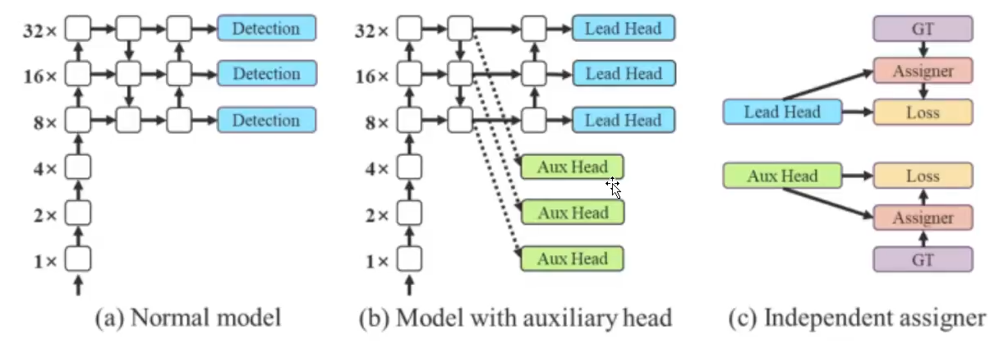

EMA model is a tech used in mean teacher, it is used as the final
inference model.  

## 2. 20221102 YOLO v1  
* Two-stage: Faster-RCNN(later 2015), Mask-RCNN   
RPN: suggested area (proposal)

* One-stage: YOLO  
Considering as a normal regression mission: images --> (x1, y1), (x2,
y2)

| Models    | Advantages                           | Disadvantages                |
| -------   | ---------                            | ---------                    |
| One-stage | Fast, online detection, tracking ... | precision_score $\downarrow$ |
| Two-stage | higher precision score               | slow (5FPS)

### 2.1 Ratios
| --            | Relevant            | Nonrelevant         |
| --            | ---                 | ---                 |
| Retrieved     | True Positive (TP)  | False Positive (FP) |
| Not Retrieved | False Negative (FN) | True Negative (TN)  |

* mAP: Computed based on pricision and recall
* IOU: area of overlap / area of union
$$Precision = \frac{TP}{TP + FP}$$
$$Recall = \frac{TP}{TP + FN}$$
* Confidence 置信度, based on confidence threshold  

YOLO: turning the detection problem into regression problem with one
CNN.

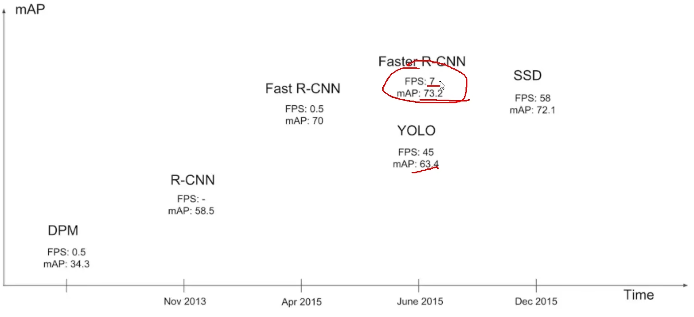

Main Idea: To predict objects in an image;   
Pixel by pixel to predict which object is on this pixel.  
Some experience of the width height propostion. 

To compute 4 params x, y, w, h for bounding box and 1 confidence for
judging the possibility of whether it belongs to an object.

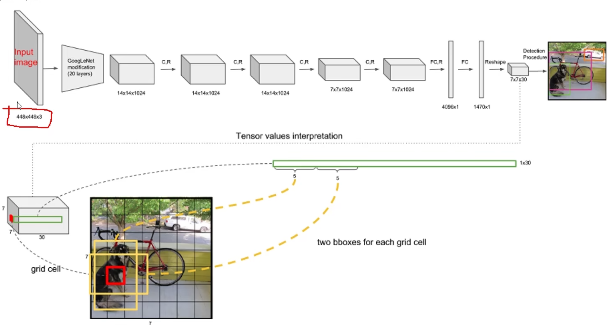

* 10 = (x, y, h, w, confidence) * B(two)  
* There are 20 classes  
* The net size is finally 7 * 7  
* (s * s) * (B * 5 + confidence)

### 2.2 The loss function  

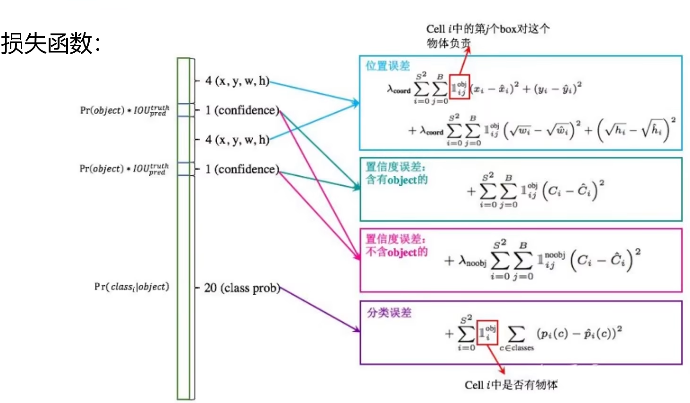

Adding the `sqrt` for weights is to solve the problem of where there 
is a smaller offset, as shown in the 
$$\lambda_{coord} \sum_{i=0}^{S^2} \sum_{j = 0}^B \mathbf{1}_{ij}^{obj}(\sqrt{w_i} -\sqrt{\hat{w_i}})^2$$

The confidence could be considered in the situation of foreground and
background. 

* When dealing with the detection objectives, there might be many bounding
 boxes which are overlaped. NMS (非极大值抑制) is for solving this problem.

### 2.3 The problem of YOLO v1  
Once if the objects are overlaped together, for example, if the dog is
staying nearby a cat.
So the problem of YOLO v1 could be inducted that:  
* Every cell could only predict one class, the problem of overlaped objects
  could nit be solved.  
* The performance of small object detection is unmarkable, the w/h is
  selectable but monotonous (单调的)

## 3. 20221102 YOLO v2
Comparing with YOLO v1:  

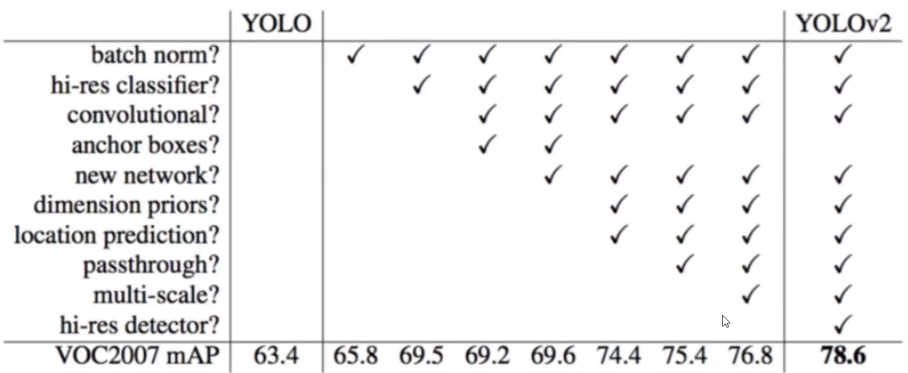

**Batch Normalization**  
* Bach Normalization after convlutional layers; Dropout is abandoned (Dropout is commonly used in
  fully connected layers to avoid overfitting)
* Inputs of every layer is normalized, convergency is relatively easier.  
* 2% of mAP would be improved after Batch Normalization processing
* Nowadays, Batch Normalization is becoming into neccessary processing step
  in recent Net design.  
**Higher Resolution**
* During YOLO v1, 224*224 is used for training, 448*448 is used for testing,
  which may impact the generalization of the Net.  
* During the training of YOLO v2, there are extra 10 times of 448*448
  fine-tuning;
* 4% of mAP improved when using higher resolution classifier

### 3.1 The Structure of YOLO v2  
Based on the concept of VGG and ResNet.  
* There is no more fully convolutional layers but 5 downsampling (maxpooling). because:
  * FC layers are easy going into overfitting  
  * FC are slow for training
* DarkNet19, the real input is 416*416 (which could be devided by $2^5$ = 32)
* the 1*1 Conv kernel saved a lot of parameters

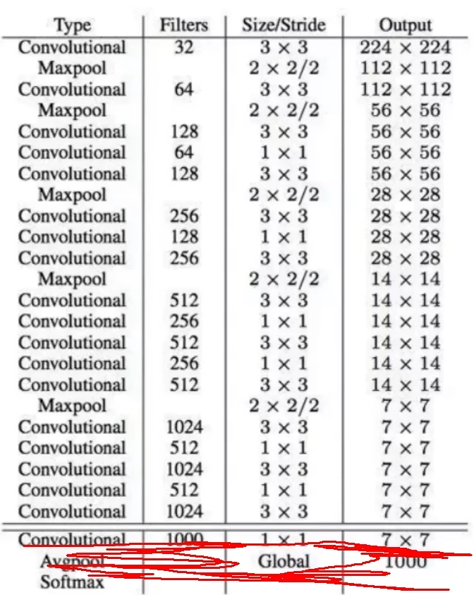

### 3.2 Techs in YOLO v2
#### 3.2.1 Clustering to extract Priori boxes  
* There are 2 different pripori boxes in YOLO v1  
* There are 9 different priori boxes in Faster-RCNN.
  However, Faster-RCNN selected regular scale rate priori boxes, 
  such as the scale rate in 1:1, 1:2, 2:1, ... .
  Such kind of boxes might be imappropriate for the dataset.  
* In YOLO v2, clustering is applied to get 5 differient kind of boxes. 
  The distance in k-means extracting priori boxes: 
  $$d(box, centroids) = 1 - IOU(box, centroids)$$
* It is found that k = 5 is appropriate for extracting(the clusters is chosed as 5)

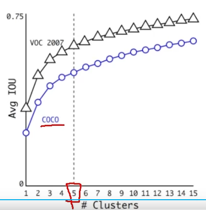

#### 3.2.2 Anchor Box 
* improves the amount of predict box (13 * 13 * n) 
* Sacrifised the mAP slightly to improve Recall (recall $\uparrow$)

#### 3.2.3 Directed Location Prediction
* bbox(bounding box): 
  center(xp, yp);  
  width and height (wp, hp);  
  then, there are:
  $$x = xp + wp * tx$$
  $$y = yp + hp * ty$$
* If $tx = 1$: bbox on $x$ moves right $wp$;  
  If $tx = -1$: bbox on $x$ moves left $wp$.  
* It may lead to the convergency problem, the model might be unstable,
  especially when the traning starts.
* Offsets are not used directly in YOLO v2, but the **grid cell** relatived
  offsets are choosen.

The equations:  
  $$b_x = \sigma(t_x) + c_x$$
  $$b_y = \sigma(t_y) + c_y$$  
  $$b_w = p_w e^{t_w}$$  
  $$b_h = p_h e^{t_h}$$
  And then use the $2^5$ to transfer into original size

### 3.3 Receptive Feild  
* The feild convered by the last feature map on the original input.
* Smaller Conv kernel size is helpful in saving
  parameters.  

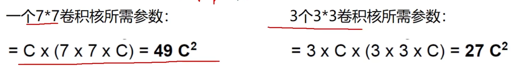

#### 3.3.1 Fine-Grained Features
(Maybe based on the concept of resNet)  
The receptive feild might be too big that small targets are missing. So the
previous features need to be fused.

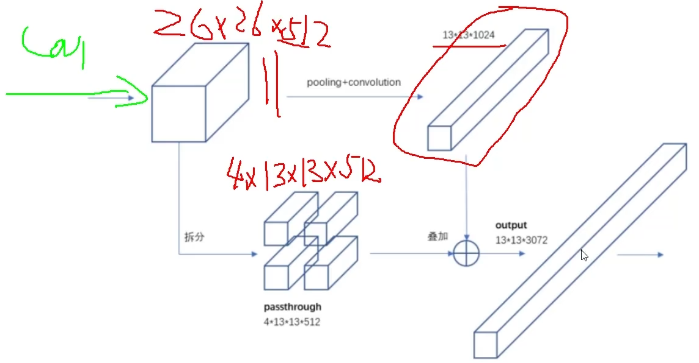

#### 3.3.2 Multi-Scale 
Resize the original inputs after iterations

## 4. YOLO v3
* The modle structure is optimized more so that it could perform better in
  **small objects detection**.  
* More priori boxes: 3 scales, and 3 kinds in each scale (totally 9).
* Detialed features: continous features are fused to predict
  multiple-scaled objects.
* Optimized the SoftMax for multiple lable prediction.
### 4.1 Multi-scale  

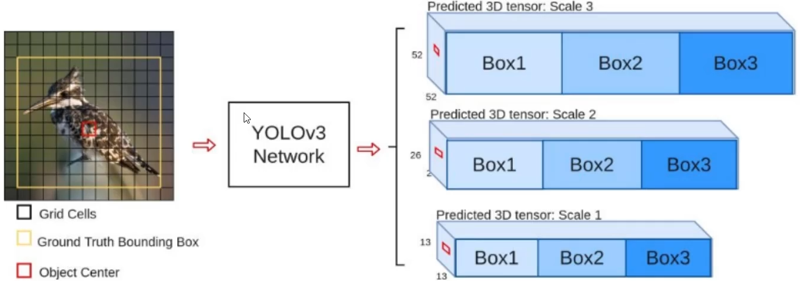

There are some commonly applied scheme for scale trasform.  
* Pyromid-like one  

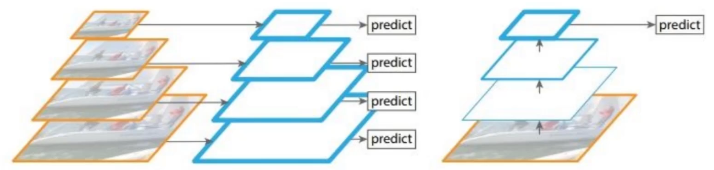

:x: It is working. However, the processing speed is very limited.  

* Features fusion for prediction (Key idea of YOLOv3)

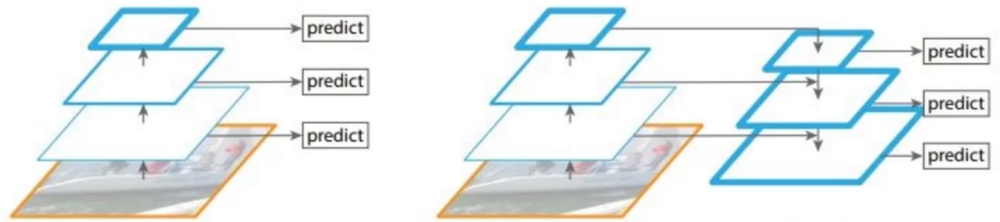

:o: Interpolation is applied to upsample and fuse different scale features.
(13 x13 --> 26 x 26 --> 52 x 52)  

### 4.2 Residual connection
Almost all frameworks of network used the residual connection

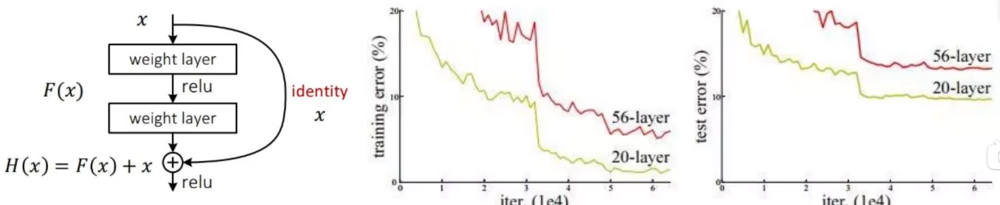

It is found in VGG19(2014) that more layers make the performance poor.  
Such idea is proposed by **Kaiming He** in ResNet paper (2016).  

### 4.3 The Network Framework
* No pooling layer and fully connected layer, it is fully convolutional;
* Downsampling came out by 'stride=2';
* 3 kinds of scale, more preori-boxes;
* Classical designs are fused (residual, FCN, ...)
The framework is named as **DarkNet53**. It seems as the ResNet  

Q: Why entirely without pooling layer?  
A: The pooling layer will zip the feature, which might impact the
performance. The pooling layer is nonlinear, so some features may left.

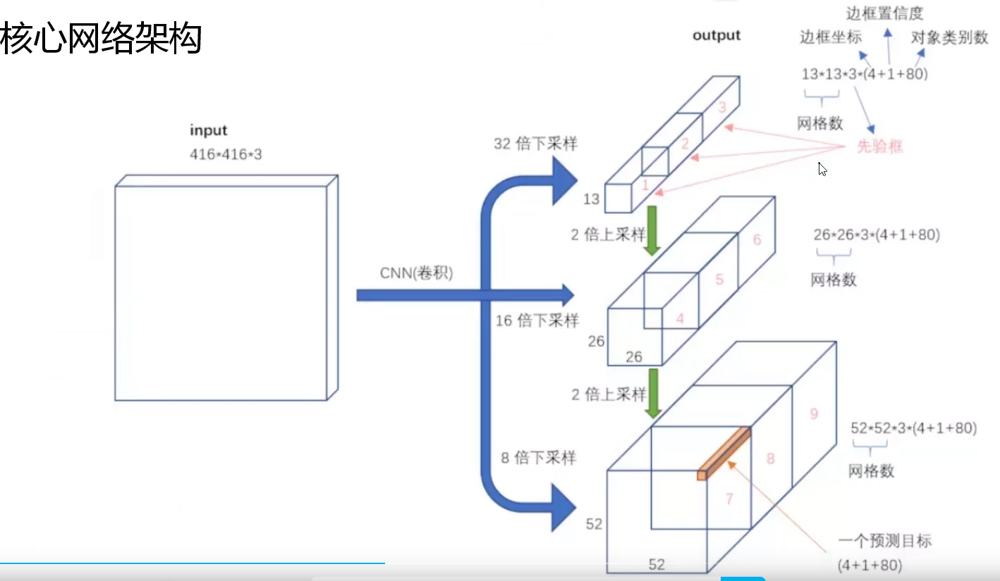

As shown in this figure, it consists of (13 x 13 x 3 * (80 + 4 + 1)):  
* 13 x 13: the feature size;  
* 3: For every feaure small box, there are 3 kinds of preori-box;   
* 80: 80 kinds of objects (wildifre then just 2: smoke, fire);  
* 4: The box coordnates, x, y, w, h;  
* 1: The confidence of the priori-box.

### 4.3 The Design of Priori-box  
In YOLOv2, 5 are chosen. There are more in YOLOv3, 9 kinds of boxes.  
**Clustering** is applied for finding these boxes.  

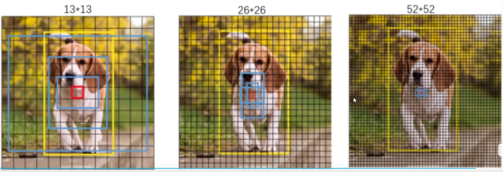

### 4.4 Replacing the SOFTMAX Layers
Multiple label is appliable in YOLOv3

## 5. YOLOv7  

VGG, 2014. RepVGG, accelerate the processing (inference-time). **Paper**:RepVGG: Making VGG-style ConvNets Great Again  
* Simple but powerful
* Has a VGG-like inference-time body composed of nothing but a stack of 3x3 convolution and ReLU  
Such decoupling of the training-time and inference-time architecture is realized by a structual re-paramiterization
technique so that the model is named RepVGG.  

### 5.1 To save the RAM
What was found in the original VGG
* 3x3 Conv is the best
* Nvidia works for 3x3
* 2 or more paths --> 1 path

### 5.2 Batch normalization
In every layer, the learned parameters might be very far away from the center. BN helps to stratch these parameters
closer to the center.  

Figure: The bias computing for each channel  
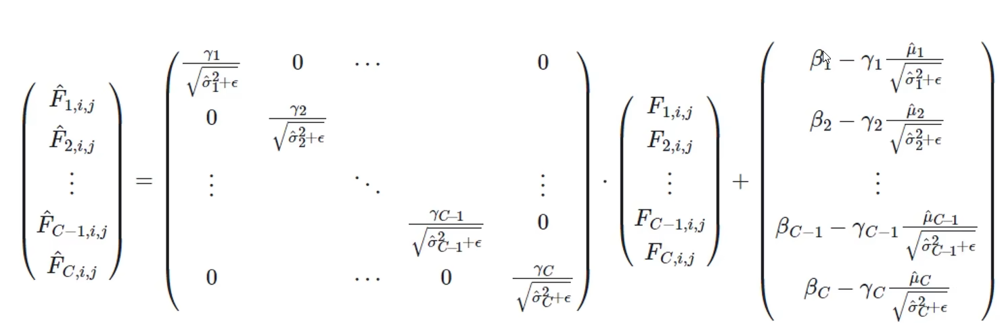

BN compute along the channel 

* $\mu$, the mean value  
* $\epsilon$, avoid 0 at bottom 
* $\gamma$, aviod not appropriate scale  
* $\beta$, aviod the center of parameters too far way from the center $(0,0)$

Compute the batch normalization in RepConv, the re-paramiterized conv kernel could be:
* weight: $W = W_{BN} \cdot W_{conv}$
* bias: $b = W_{BN} \cdot b_{cov} + b_{BN}$

### 5.3 1x1 --> 3x3
Padding for Conv kernel, the original image also need padding
* Considering the optization of Nvidia, turn 1x1 conv into 3x3 conv.
* To save the RAM, combine the 1x1 branch into main branch

### YOLOv5 + YOLOx
What is anchor?
YOLOv7 improves the recall

<!--maskformer-->
<!--for project V5 should be better-->
<!--mask2former-->
