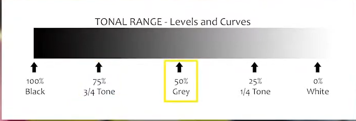

Easyier to keep have trackings.  
* The difference between Gray8 and Gray16 iamges 
* Measuring your first tempreture from a thermal image 
* Measureing tempreture from a thermal video
* Measuring tempreture from a thermal camera

### What is the Bit Depth of an image?
<p></p>
1. Convert the oroginal GRB image into gray16 --> gray8
```
import numpy as np  
import cv2  

# open the gray16 image
gray16_image = cv2.imread("lighter_gray16_image.tiff", cv2.IMREAD_ANYDEPTH)

# convert the gray16 iamge into a gray8
gray8_image = np.zeros((120, 160), dtype = np.uint8)
gray8_image = cv2.normalize(gray16_image, gray8_image, 0, 255, cv2.NORM_MINMAX)
gray8_image = np.uint8(gray8_image)

# color the gray8 image using OpenCV colormaps
inferno_palette = cv2.applyColorMap(gray8_image, cv2.COLORMAP_INFERNO)
jet_palette = cv2.applyColorMap(gray8_image, cv2.COLORMAP_JET)
viridis_palette = cv2.applyColorMap(gray8_image, cv2.COLORMAP_VIRDIS)

# show the different thermal color palettes
cv2.imshow("grayscale", gray8_image)
cv2.imshow("inferno", inferno_palette)
cv2.imshow("jet", jet_palette)
cv2.imshow("viridis", viridis_palette)
cv2.waitKey(0)
```

2. Measure image tempreture
```
import numpy as np 
import cv2 

# open agian the gray16 image 
gray16_image = cv2.imread("lighter_gray16_image.tiff", cv2.IMREAD_ANYDEPTH)

# get the first gray16 value 

# define the pixel coordinate 
x = 90
y = 100

pixel_flame_gray16 = gray16_image[y, x]

# calculate tempreture value in *C 
# pixel_flame_gray16 = (pixel_flame_gray16 / 100) - 273.15

# calculate tempreture value in *F 
pixel_flame_gray16 = (pixel_flame_gray16 / 100) * 9 / 5 - 459.67

# RGMVISION.com 

# Write pointer
cv2.circle(gray8_image, (x, y), 2, (0, 0, 0), -1)
cv2.circle(gray16_image, (x, y), 2, (0 ,0 ,0), -1)

# Write tempreture value in gray8 and gray16 image 
cv2.putText(gray8_image, "{0:.1f} Fahrenheit".format(pixel_flame_gray16), (x - 80, y - 15), cv2.FONXXXXXXX)
cv2.putText(gray16_image, "{0:.1f} Fahrenheit".format(pixel_flame_gray16), (x - 80, y - 15), cv2.FONXXXXXXX)

# Show results
cv2.imshow("gray8-fahrenheit", gray8_image)
cv2.imshow("gray16-fahrenheit", gray16_iamge)
cv2.waitKey(0)

```

3. Measure tempreture from a thermal video
```
import cv2 
import numpy as np 
import os 
import argparse 

# construct the argument parse and parse tje arguments 
ap = argparse.ArgumentParser()
ap.add_argument("-v" "--video", required = True, help = "path of the video sequence")
aegs = vars(ap.parse_args())

# create mouse global coordinates 
x_mouse = 0 
y_mouse - 0

# create thermal video fps variable (8 fps in this case)
fps = 8

# mouse events function
def mouse_events(event, x, y, flags, param):
  # mouse movement event 
  if event == cv2.EVENT_MOUSEMOVE:
    # update mouse global coordinates 
    global x_mouse 
    global y_mouse 
    
    x_mouse = x
    y_mouse = y 

# set up mouse events and prepare the thermal frame display
gray16_frame = cv2.imread("lighter_gray16_image.tiff", cv2.IMREAD_ANYDEPTH)

# Q: Why calling gray8 here?
cv2.imshow("gray8", gray16_frame)
cv2.setMouseCallback('gray8', mouse_events) 

# loop over the thermal video frames
for iamge in sorted(os.listdir(args["video"])):
  
  # filter .tiff files (gray16 images)
  if image.endwith(".tiff"):
    
    # define the gray16 frame path 
    file_path = os.path.join(args["video"], image)

    # open the gray16 frame 
    gray16_frame = cv2.imread(file_path, cv2.IMREAD_ANYDEPTH)
    
    # calculate tempreture 
    tempreture_pointer = gray16_frame[y_mouse, x_mouse]
    # tempreture pointer 
    tempreture_pointer = (tempreture_pointer / 100) * 9 / 5 - 459.67 

    # covert the gray16 frame into a gray8 
    gray8_frame = np.zeros((120, 160), dtype = np.uint8)
    gray8_frame = cv2.normalize(gray16_frame, gray8_frame, 0, 255, cv2.NORM_MINMAX)
    gray8_grame = np.uint8(gray8_frame)

    # colorized the gray8 frame using CV colormaps 
    gray8_frame = cv2.applyColorMap(gray8_frame, cv2.COLORMAP_INFERNO)

    # write pointer 
    cv2.circle(gray8_frame, (x_mouse, y_mouse), 2, (255, 255, 255), -1)

    # write tempreture 
    cv2.PutText(gray8_frame, "{0:.1f} Fahrenheit".format(tempreture_pointer), (x_mouse - 40) )
    
    # show the thermal frame 
    cv2.imshow("gray8", gray8_frame)

    # wait 125ms (FPS = 8): RGMVison ThermalCAM1 frame per seconds = 8
    cv2.waitKey(int(1 / fps) * 1000)
     

```

4. Use the real thermal camera
```
```

## Data Fusion
Deep learning has an inbuilt automatic stage feature process that learns rich hierarchical representations (i.e.
features).
Ptchy Operation
1. Apply a set of weights -- a filter -- to extract **local features**
2. Use **mltiple filters** to extract different features  
3. **Specially share** parameters of each filter
