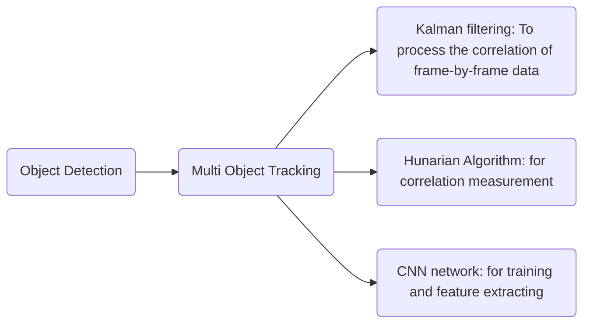

# How DeepSORT works

## 1. Some comparision
### 1.1 Track by detection
* YOLOv4  
* Detectron2  
Disadvantage: Disturbance swoops in front of camera, the tracking will loose  

### 1.2 Traditional methods  
* Mean Shift  
* Optical Flow (Lucas Kanade)  
  * computationally complex
  * Prone to noise  
  * track lost during occlusion

### 1.3 SORT
* Kalman filter is acrucial compoments in DeepSORT
* SORT: Simple Online Realtime Tracking
The SORT comprises of 4 core components which are: Detection, Estimation, Target Association, 
#### 1.3.1 Detection  
Better Detection = Better Tracking  
800*600 image --> VGG16 --> 50*37*256 feature maps
#### 1.3.2 Estimation 
Detection --> Kalman filter  
E.g. For tracking rocket:  
  $$x = [u, v, s, r, \dot{u}, \dot{v},\dot{s}]^T$$
  where:  
* $u$: Horizontal pixel location of target center  
* $v$: Vertical pixel location of target center  
* $s$: Scale area of target bounding box  
* $r$: Aspect ratio of the target's bounding box
#### 1.3.3 Target Association  
Detection --> Kalman filter --> Target Association  
Each target's bounding box geometry is estimated by predicting its new location in the latest frame.  
The assignment cost matrix is then computed as the intersection-over-union (IOU) distance between each detection.  
$$IoU = \frac{Area of Overlap}{Area of Union}$$
#### 1.3.4 Track Identity Life Cycle
Detection --> Kalmanfilter --> target Association --> Target ID life cycle  
When objects enter and leave the image, unique identities need to be created or destroyed accordingly.  
 Tlost frame  

## 2. DeepSORT
CNN Object Detection --> SORT Object Tracking  
**Question: What makes DeepSORT so different?**
* Object detector that provides us detections
* The almighty Kalman filter tracking it and giving us missing tracks
* The Hungarain algorithm associates detections to tracked objects 

** Advantages of SORT **
* Overall good performance in terms of tracking precision and accuracy  
* Depite the effectiveness of Kalman filter, it returnsa relatively high number of identity switches  
* It has a deficiency in tracking throug occlusionsand different viewpoints  

**What is the difference between SORT and DeepSORT?**  
For DeepSORT, the authors introduced another distance metric based on the "appearance" of the objects.  
**Appearance Feature Vector**  
### 2.2 DeepSORT framework  
* a classifier is build based on dataset, which is trained meticulously until it achieves a reasonably good accuracy.  
* take this network and strip the final classification layer leaving behind a dense layer that produce a single feature
  vector, waititng to be classified.
* Use nearest neighbor queries in the visual appearance, this is to establish the measurement-to-track association (MTA),
  which is the process of determining the relation between a measurement and an existing track. ---- We also use the
  Mahalanobis distance as oppose to the euclidean distance for MTA.  
#### 2.2.1 DeepSORT Advantages  
* ID Switches reduced by 45%  
* High FPS  
#### 2.2.2 DeepSORT Alternatives  
| Models| Advantages| Challenges|
| ---| ---| ---|  
| Tracktor++| Accurate| Very slow|
| Track RCNN| Segmentation as bonus| very slow|
| JDE| Displayed decent performance of 12 FPS on average| Low resolusion|
| DeepSORT| * Fastest (16 FPS); * good accuracy; * Asolid choice for multiple object detection and tracking.| ---|  

**DeepSORT** is used for multiple object tracking  
* Need to do bounding box detections first and then tracker need to be combined with a detector  

